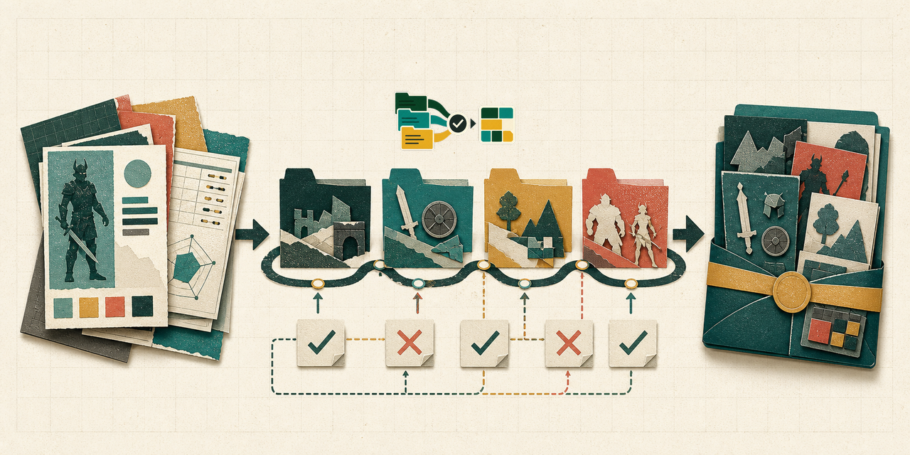

# NexusRealtime Ideas



NexusRealtime Ideas is the folder-driven research, catalogue, and candidate-packet workspace for the NexusRealtime ecosystem. It turns source game records and scoped observations into reviewable domain-kit ideas without owning stable runtime code.

```text
source record -> scoped catalogue -> validation feedback -> candidate packet -> builder queue
```

## Repository boundary

This repository owns:

- domain and gameplay idea discovery;
- game-profile intake and bounded JSONL exports;
- validation feedback and repair records;
- kit-idea packets, promotion notes, and builder queues;
- agent operating state for catalogue work.

It does not own NexusRealtime Core, ProtoKit implementation, or playable experiment routes. Those belong in their respective implementation repositories.

## Start here

1. Read [`.agent/START_HERE.md`](.agent/START_HERE.md).
2. Review [`.agent/current-state.md`](.agent/current-state.md) and [`.agent/workflow.md`](.agent/workflow.md).
3. Choose one folder-scoped task from [`scopes/`](scopes/README.md).
4. Use the relevant command from [`docs/operations.md`](docs/operations.md).
5. Record evidence in the required `.agent/` lane before stopping.

The governing rule is **scope is always a folder**. A tag, issue, or free-form note is not the durable owner of an idea.

## Repository map

```text
.agent/          Operating state, saved lanes, promotion gates, and run records
scopes/          Domain scope cascade from inbox to promotion or hold
sources/         Source provenance and import manifests
games/           Source game profiles
publish-games/   Reusable JSONL exports, capped at 5,000 records per chunk
feedback/        Audit summaries and line-addressable repair findings
ideas/           Intake, generated runs, tracking state, and domain packets
harnesses/       CascadeSeeder Lite idea-generation harness
scripts/         Game-profile CLI, validator, and source import tooling
kits/            Experimental kit-idea registry
docs/            Architecture, contracts, operations, and visual guidance
```

## Safe orientation

Node.js 20 or newer is required. These commands inspect state without intentionally changing catalogue records:

```bash
npm run games:estimate
npm run games:split
npm run ideas:kit-next
node scripts/game-profile-cli.mjs validate --path games/rawg/chunks/rawg-0001.jsonl
```

The full corpus is large. Run bounded validation first. `games:audit`, `games:fix`, imports, packet generation, and CascadeSeeder runs write repository data; read [the operations guide](docs/operations.md) before using them.

## Current recorded scale

The committed indexes record:

- 881,069 RAWG-derived profiles in 177 chunks;
- a 5,000-record export chunk limit;
- four tracked kit-idea runs producing 480 packets;
- a historical full-corpus audit on 2026-07-02 reporting zero issues.

These are repository records, not a guarantee about later changes. Revalidate the affected scope before relying on them.

## Automation

CascadeSeeder Lite runs from the `build` branch or manual workflow dispatch. Its latest listed GitHub Actions run succeeded on 2026-06-27. The workflow can use NVIDIA NIM, fall back to llama.cpp, emit run evidence, and commit generated catalogue output to `build`.

Scheduled catalogue workers are still planned, not enabled. Do not create schedules unless explicitly requested.

## Documentation

- [Documentation index](docs/README.md)
- [Architecture](docs/architecture.md)
- [Data contracts](docs/data-contracts.md)
- [Operations](docs/operations.md)
- [Contributing](CONTRIBUTING.md)
- [Security](SECURITY.md)
